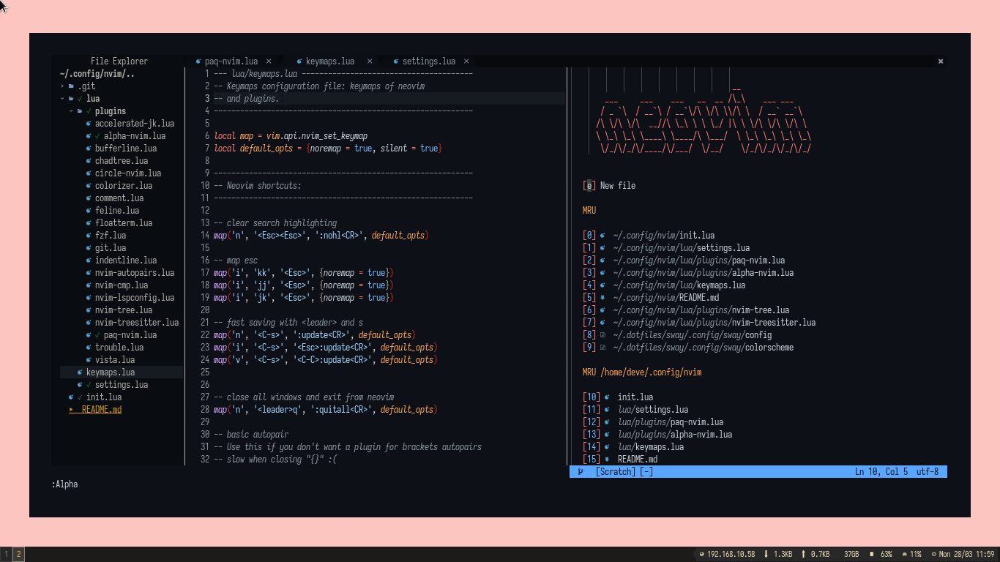

# Neovim as main idea

hello in this repo using native LSP from neovim  >= 0.5
if you use are using COC.nvim check this repo

https://github.com/mohamad-supangat/nvim




Tanks to: [Brainf+ck](https://github.com/brainfucksec/neovim-lua) for your simple dotfiles and give me idea to use init.lua and native LSP


## Docs

### Shortcuts

Some of the shortcuts I use frequently are listed here. In the following shortcuts, `<leader>` represents ASCII character `,`.

| Shortcut                          | Mode   | Description                                                                         |
| --------------------------------- | ------ | ----------------------------------------------------------------------------------- |
| `<ctrl>p`                         | Normal | Fuzzy file searching in a floating window                                           |
| `<ctrl>n`                         | Normal | Open sidebar file explorer                                                          |
| `<ctrl>t`                         | Normal | New file                                                                            |
| `<ctrl>PageDown` / `<ctrl>PageUp` | Normal | Change tab to next and prev                                                         |
| `<space>bd`                       | Normal | Close Buffer / File                                                                 |
| `<alt>i` / `F1` / `F2`            | Normal | Toogle floating terminal                                                            |
| `<space>uu`                      | Normal | Open lazy.nvim updater                                                      |
| `<space>P`                        | Normal | Open list of coc commands                                                           |
| `F7`                              | Normal | Toogle sidebar tags explorer                                                        |
| `<space>rr`                       | Normal | Run current file by [code_runner.nvim](https://github.com/CRAG666/code_runner.nvim) |
| `<space>git                       | Normal | Run lazygit(install lazygit first) [code_runner.nvim](https://github.com/CRAG666/code_runner.nvim) |


### Structure

```
├── LICENSE
├── README.md
├── assets
│   └── screenshot_20220328-120014.png
├── init.lua
├── lazy-lock.json
└── lua
    ├── colorscheme (colorscheme configurations)
    ├── configs.lua (init script for all plugins)
    ├── keymaps.lua (global keymap)
    ├── lsp         (All lsp configurations here)
    ├── plugins     (some plugins and setting here)
    │   ├── accelerated-jk.lua
    │   ├── autopairs.lua
    │   └── ....  (more plugin)
    ├── pre-settings.lua (global setting than run before lazy.nvim start)
    ├── settings.lua     (global setting)
    └── variables.lua    (global variable to use in some lua file)
```
